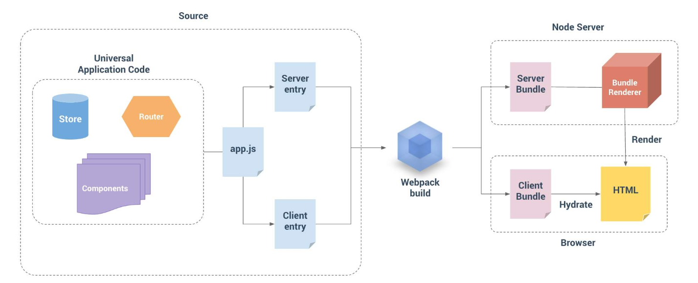
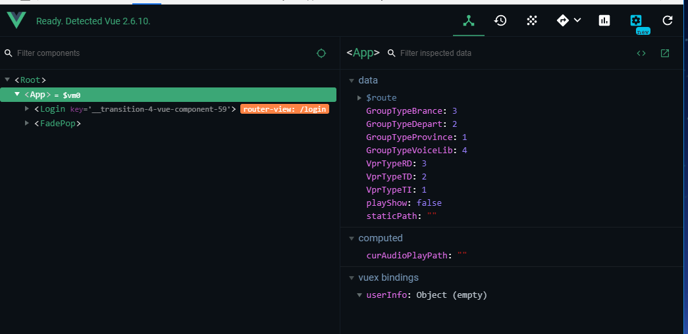
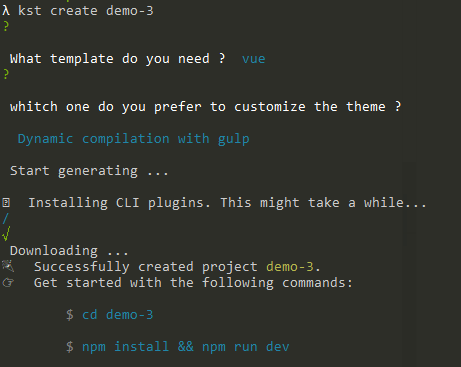
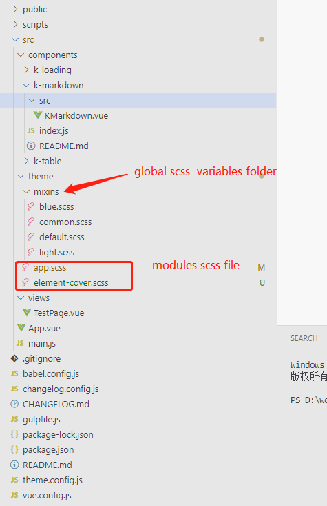
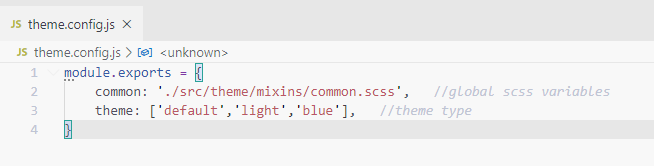
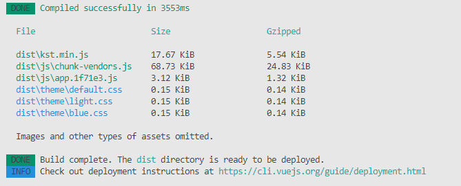
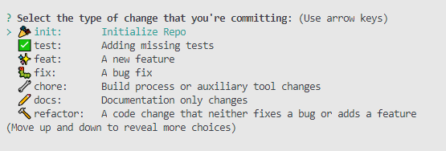

# 浅谈前端工程化

> 三流程序员写**UI**，二流程序员写**框架**，一流程序员写**算法**，顶级程序员穿**女装!!!** 

## 前言

 前端 —— 技术圈的娱乐圈 ，在大前端的趋势下，以往的前端开发模式已经不能很好地承载实际的项目需求，我们需要一系列方案来使我们的项目变得规范、可配置、优化等。本文就针对这个问题做简单分析，并给出一系列的解决方案。

## 了解我们目前所处的阶段

首先我们需要认识到，前端是一种技术问题相对少、工程化问题相对多的软件开发领域。前端开发虽然相对简单，但是也会遇到不少问题：

1. 大体量：多功能、多页面、多状态、多系统
2. 大规模：**多人**甚至多团队参与开发
3. 高性能：CDN、缓存、请求合并、按需加载、同步/异步加载、首屏渲染

## 什么是技术架构

> 技术架构是指社会中各种技术之间相互作用、相互联系、按一定目的、一定结构方式组成的技术整体。

归根揭底 —— 技术架构（技术体系）就是围绕业务发展、团队规模和团队特点量身打造的，最终目的都是在确保线上的质量和稳定性的前提下，来提升团队整体的开发效率。

说到这里，我们可以梳理下我们团队目前的项目和团队背景这些特点：

* 项目的特点：**大同小异** 。基本上都是查询、表单、语音文件上传这么3种页面。目前团队每个项目都是针对前端每个项目重新去做这些东西（比如 `ctrl + c，v` ）   
* 团队的特点： **规模小** 。虽然目前前端研发成员不多，但是相信公司会做**大**做**强** = =，那么大家就知道规模化会带来沟通成本的提高，我们希望尽可能地降低因此带来的成本提升来实现规模效应

## 解决方案

要解决上面的问题、我们应该以下几方面入手：

1. 整体规范
    - 设计规范： 设计规范是前端工程界面部分规范重要的组成部分。如果设计和产品没有采取一定的规范，将会导致最终的产品体验和工程化产物复用率很低，不适合大多数项目。所以这里建议从原型设计到设计稿，要有一套完整的设计规范，去除不必要的自由发挥。

    - 前端代码规范： 从源头开始制定代码规范。

    - 构建规范： 从构建工具开始，每个细节就告诉研发人员该如何操作，怎样才是规范的，提供完整的文档说明以及辅导分享体制

2. 组件化开发

    - 前端作为一种GUI展示，光有js\css 模块化还远远不够，对UI组件的分治也有同样迫切的需求。个人强烈建议团队中要有一定比例的开发人员服务UI组件的开发，而另外一部分的开发人员负责使用、维护、提出优化建议。

3. 不同维度

    - 而在实际项目场景中，我们有时候需要根据具体的组件、具体的页面、具体的业务模块采取对应的开发策略。    

### 通过以上的标准化约束能给我们带来很多好处：

对于项目来说，我们可以把可复用的部分抽离出来，通过标准化来提高它的复用率。比如目前在构建的通用业务组件库 k-view  包含了各个业务项目中可复用的组件；再比如说部署、监控等服务抽离出来，做成独立的服务，提供各个业务线来使用（k8s）。所以说标准化后的项目，我们不必再做重复的技术选型，并且可以方便地利用各种公共服务来实现最终 `提高效率的目的` 。

## 自动化 （......）

## 工程化实践 

* 构建工具 [kst-cli | Standard Tooling for Vue.js Development ](https://www.npmjs.com/package/kst-cli)
* 通用类库 [kst-util | Promise based HTTP client for the browser and node.js](https://www.npmjs.com/package/kst-util)
* 技术选型 [Vue](https://cn.vuejs.org/index.html)
* IDE [Visual Studio Code](https://code.visualstudio.com/)    
    - Vetur
    - Vue-2-Snippets
    - vue-beautify
    - ESLint
* 开发环境 Chrome 
    - 
* 包源管理
    - [npm](https://www.npmjs.com/)    
    - [nrm](https://www.npmjs.com/package/nrm)    
    - [nvm](https://www.npmjs.com/package/nvm)    
* 版本控制 Git

### **kst-cli**
可以当作简易版vue-cli 来看，目前支持的模板有` vue 、 react `模板。其中vue模板支持的皮肤定制目前是两套实现方案:

- Static compilation with sass-resource-loader （单一皮肤编译 , 全局注入通用类库 [kst-util](https://www.npmjs.com/package/kst-util) ）

- Dynamic compilation with gulp （动态编译多套皮肤，全局注入通用类库 [kst-util](https://www.npmjs.com/package/kst-util) ）
   - 目录结构：

        

   - 主题配置文件：

        

    - Commands
        - npm run dev 
            
        - npm run build  （打包）

            

        - npm run commit （git提交）[【提交规范-业界比较推荐的是 angular 团队的】](https://www.conventionalcommits.org/en/v1.0.0/)

            

